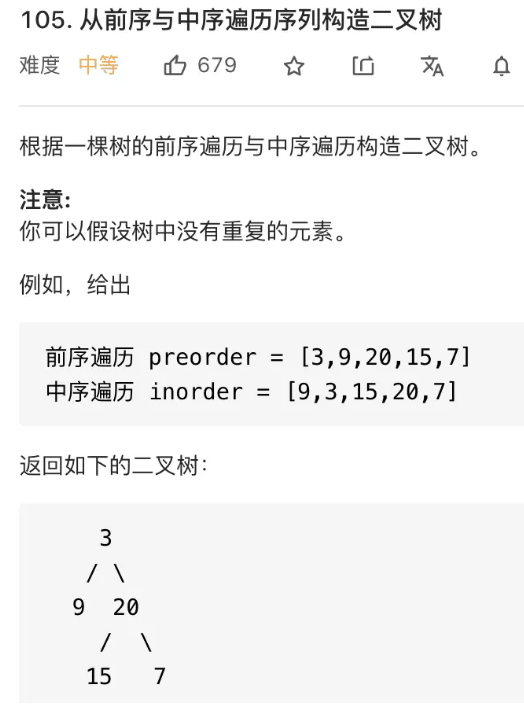
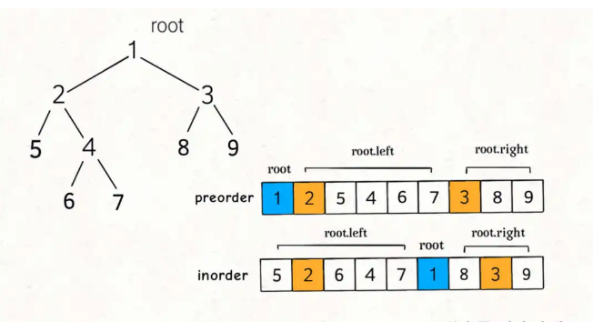
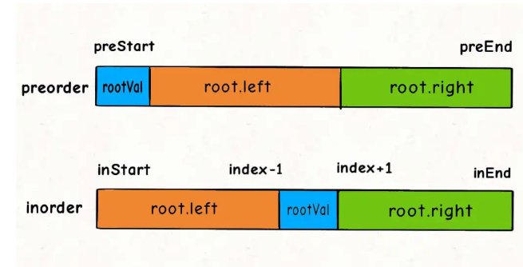
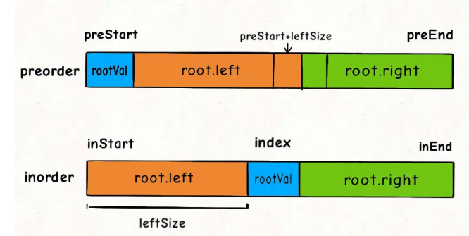

### 二叉树
#### 二叉树的遍历
> 1. 路径：也就是已经做出的选择
> 2. 选择列表：也就是你当前可以做的选择
> 3. 结束条件：也就是到达决策树的底层，无法再做选择的条件

二叉树遍历框架：
```JavaScript
function traverse(root){
    //前序遍历
    traverse(root.left);
    //中序遍历
    traverse(root.right);
    //后序遍历
}
```
**其核心就是for循环里面的递归，在递归调用之前做选择，在递归调用之后撤销选择**

#### 二叉树相关算法解读
##### 通过前序和中序遍历结果构造二叉树
  
> 函数签名如下
var buildTree = function(preorder,inorder){

}
###### 分析：
* 根据前序遍历和中序遍历的遍历框架，可知preorder和inorder数组中的元素分布有如下特点：
 
* 那么对于root节点来说，preorder[0]就是root节点的值。
* 对于inorder的拆分左右子树的起始索引和中止索引的确定
 
* 对于preorder的左右子树对应的起始索引和中止索引，可通过左子树的节点数推到出来，假设左子树的节点数为leftSize，那么preorder数组上的索引情况是这样的：
 
* 而leftSize即为inorder中对应跟节点索引位置减去inorder的起始索引
