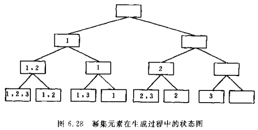

## 第6章 树和二叉树 ——求集合的幂集

### 算法说明
 比如[1,2,3]的幂集为[[],[1],[2],[3],[1,2,3],[1,2],[1,3],[2,3]]。
### 算法思路
>* 集合A的每个元素，只有两种状态：属于幂集的元素集或不属于幂集的元素集。
>* 求A的幂集元素的过程可看成依次对集合A中元素进行“取”或“舍”的过程。
>* 如图所示的二叉树，表示过程中幂集元素的状态变化状况，树中的根节点表示幂集元素的初始状态（空集）；叶子节点表示它的终结状态；而第i层的分支节点，则表示已对集合A中前i-1个元素进行了取舍处理的状态（左分支表示“取”，右分支表示“舍”）。
>* 因此，求幂集元素的过程即为先序遍历这棵状态树的过程，具体算法如下：
   

### javascript函数：

```JavaScript
function GetPowerSet(i,A,B){
    let k = 0;
    let e;
    if (i >= A.length) {
        console.log(B);
    } else {
        e = A[i];
        k = B.length;

        B.push(e); //+第i个元素
        GetPowerSet(i + 1, A, B);

        B.pop(e); //-第i个元素
        GetPowerSet(i + 1, A, B);
    }
}
```