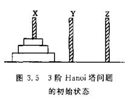

# 第3章 栈和队列 ——Hanoi

## 算法说明
### (n阶Hanoi塔问题)假设有3个分别命名为X,Y和Z的塔座，在塔座X上插有n个直径大小各不相同，依小到大编号为1，2，...,n的圆盘（如图所示），现要求将X轴上的n个圆盘移至塔座Z上并扔按童谣顺序叠排，圆盘移动时必须遵循下列规则：
   
##### （1）每次只能移动一个圆盘；
##### （2）圆盘可以插在X、Y和Z中的任一塔座上；
##### （3）任何时刻都不能讲一个较大的圆盘压在较小的圆盘之上
>实现移动圆盘的操作：当n=1时，将编号1的圆盘移到Z上即可；当n>1时，利用塔座Y做辅助塔座，若能设法将X上的n-1个圆盘从塔座X移到Y上，就可以将编号n的圆盘移到Z上，然后再将塔座Y上的n-1个圆盘移至塔座Z上。如何将n-1个圆盘从一个塔座移至另一个塔座的问题是一个和原问题具有相同特征属性的问题。因此可以用同样的方法求解。由此可得求解n阶Hanoi塔问题的javascript函数：
```JavaScript
function move(from, n, to) {
    to.push(from.pop());
}
function hanoi(n, x, y, z) {
    if (n == 1) {
        move(x, 1, z);//将编号为1的圆盘从x移到z
        // return [x,y,z];
    } else {
        hanoi(n - 1, x, z, y);//将x上编号为1至n-1的圆盘移到y，z做辅助塔
        move(x, n, z);//将编号为n的圆盘从x移到z
        hanoi(n - 1, y, x, z);//将y上编号为1至n-1的圆盘移到z，x做辅助塔
    }
    return [x,y,z];
}
```